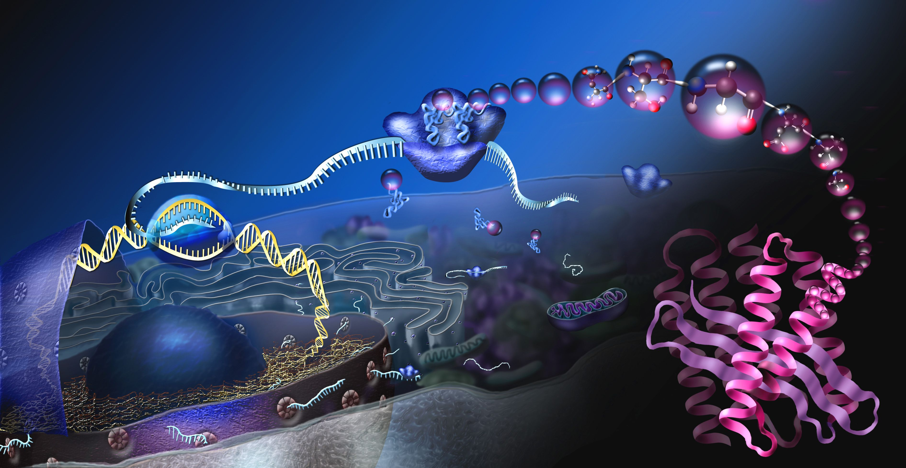

### Hi friends 👋

- 🔭 I am a graduate student in biophysics in ZJU.
- 🌱 I’m currently learning computational biophysics, molecular dynamics simulation, etc.
- 👯 I’m looking to collaborate on structure and interaction of biomolecules, and subsequent molecular design.
- 🤔 I’m always thinking about going around the world, seeing and thinking what happens out in the universe.
- 💬 Talk with me about science/philosophy: math, physics, chemistry, biology, astronomy, ...
- 😄 Hobbies: ball sports, reading, traveling, eating a lot of food; coding, techniques.
- ⚡ The more we know, the clearer we can see the universe and ourselves. Do what I want and be happy.
- 📫 How to reach me: gxf1212@zju.edu.cn

**[Subscribe my channel at Bilibili](https://space.bilibili.com/441196634)** for courses from abroad! [Visit my notes site](https://gxf1212.github.io/notes) if you want!

