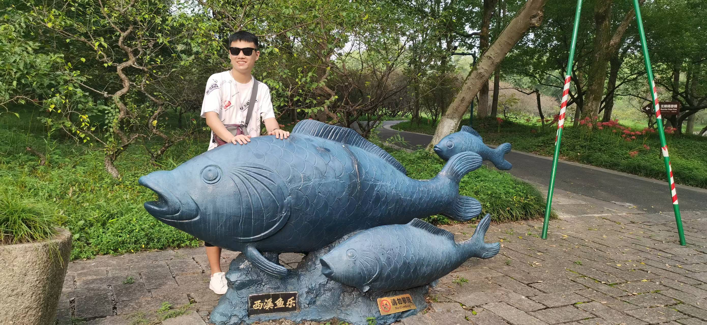

### Hi there 👋

- 🔭 I am a graduate student in biophysics in ZJU.
- 🌱 I’m currently learning computational biophysics, molecular dynamics simulation, etc.
- 👯 I’m looking to collaborate on Linux, coding, techniques.
- 🤔 I’m looking for help with science/philosophy.
- 💬 Talk with me about math, physics, chemistry, biology, astronomy, ...
- 📫 How to reach me: gxf1212@zju.edu.cn
- 😄 Hobbies: ball sports, reading, eating a lot of food
- ⚡ The more we know, the clearer we can see the universe and ourselves.

